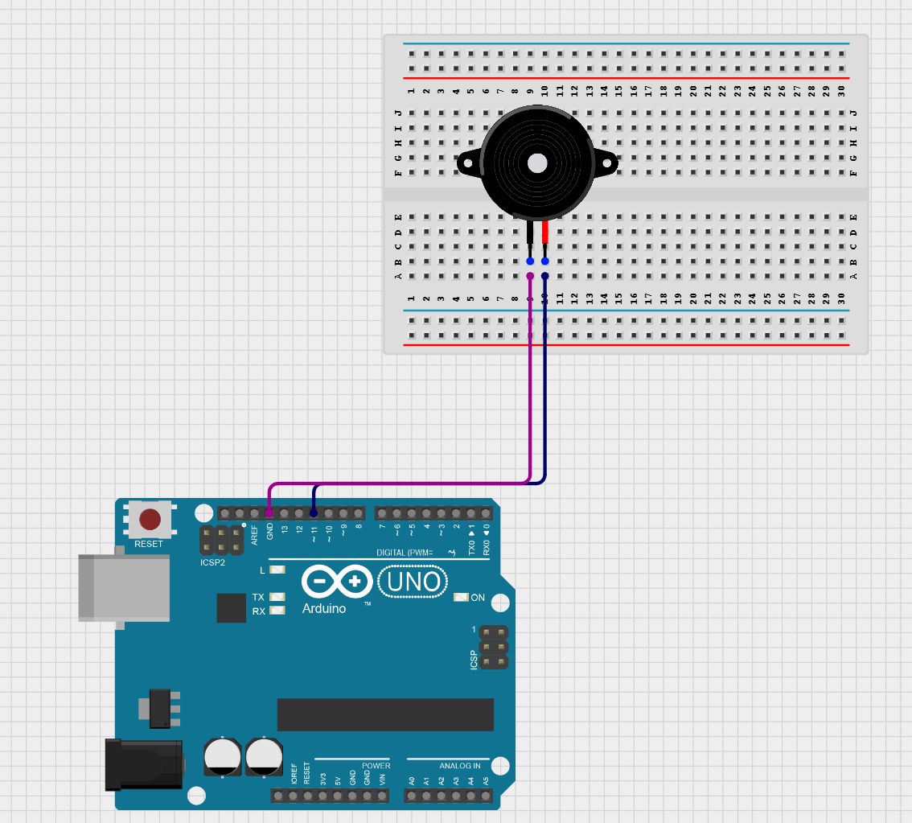

# 🎵 Audio on Passive Buzzer via Arduino

Play a melody extracted from any audio file on a passive buzzer using Python (librosa + pYIN) and Arduino.

 

---

## Table of Contents

- [Overview](#overview)
- [Theory & Math](#theory--math)
- [How It Works](#how-it-works)
- [Requirements](#requirements)
- [Step-by-Step Guide](#step-by-step-guide)
- [Project Structure](#project-structure)
- [Notes & Limitations](#notes--limitations)
- [References](#references)

---

## Overview

A passive buzzer can only play one frequency at a time. This project extracts the **fundamental frequency (f0)** from an audio file frame-by-frame using the pYIN algorithm and replays the melody on a buzzer connected to an Arduino.

---

## Theory & Math

### Sampling & the Waveform
Audio is a continuous signal digitized at a **sample rate** (e.g., 44100 Hz), meaning 44,100 amplitude values are captured per second. Duration = `num_samples / sample_rate`.

### Short-Time Fourier Transform (STFT)
The STFT slides a window over the signal and applies the **Discrete Fourier Transform (DFT)** to each window, producing a time-frequency spectrogram. For a window of N samples:


This decomposes the signal into its constituent frequencies at each moment in time.

### pYIN (Probabilistic YIN)
YIN detects pitch by computing the **difference function**:

A normalized version of this function (CMNDF) is minimized to find the fundamental period, and therefore the **fundamental frequency f0 = 1/T**. pYIN adds a probabilistic layer using hidden Markov models to improve accuracy and reduce octave errors.

### Frame Duration
Each frequency extracted corresponds to one STFT frame:

```
frame_duration (ms) = (hop_length / sample_rate) × 1000
```

This value becomes the `delay()` in the Arduino sketch.

### Buzzer & `tone()`
A passive buzzer requires an externally generated square wave. Arduino's `tone(pin, frequency)` uses a hardware timer to toggle the pin at the given frequency, producing sound.

---

## How It Works

```
Audio File (.mp3)
      │
      ▼
  librosa.load()          → raw waveform + sample rate
      │
      ▼
  librosa.stft()          → spectrogram (visualization)
      │
      ▼
  librosa.pyin()          → f0 time series (fundamental frequencies)
      │
      ▼
  Post-processing         → strip NaNs, convert to int, trim silence
      │
      ▼
  Arduino sketch          → tone(pin, f) + delay(frame_duration)
      │
      ▼
  Passive Buzzer          → 🎵
```

---

## Requirements

### Python (Jupyter Notebook)
- Python 3.x (If using a different IDE, use 3.11 stable release. There seems to be some dependecy error for other versions.)
- `librosa`
- `numpy`
- `matplotlib`

Install dependencies:
```bash
pip install librosa numpy matplotlib
```

### Hardware
| Component | Details |
|---|---|
| Arduino (any) | Uno, Nano, etc. |
| Passive buzzer | Must be **passive**, not active |
| Jumper wires | — |
| USB cable | For uploading sketch |

### Software
- Arduino IDE (or PlatformIO)
- Google Colab or Jupyter Notebook

---

## Step-by-Step Guide

### Step 1 — Prepare your audio file
Upload your audio file to the notebook environment and rename it `song.mp3` (or update the filename in the code).

### Step 2 — Run the Jupyter Notebook
Open `audio_on_buzzer.ipynb` and run all cells in order:

1. **Load audio** — loads waveform and prints sample rate and duration.
2. **Visualize waveform** — plots amplitude over time.
3. **STFT + Spectrogram** — computes and visualizes the time-frequency representation.
4. **pYIN pitch extraction** — extracts f0 frame-by-frame over the range C1 (~32 Hz) to C6 (~1047 Hz).
5. **Post-process** — strips NaN values, converts floats to ints, trims leading/trailing silence.
6. **Get frame duration** — prints the `delay()` value (in ms) to use in Arduino.

### Step 3 — Copy output to Arduino sketch
From the notebook output, copy:
- The printed frequency array → paste into `int frequencies[] = { ... };`
- The printed frame duration → set as the `delay()` value in the sketch

### Step 4 — Wire the circuit
Connect the passive buzzer to the Arduino:

| Buzzer Pin | Arduino Pin |
|---|---|
| `+` (signal) | Digital Pin 11 |
| `−` (ground) | GND |

Refer to `audio_to_buzzer_Circuit.png` for the full wiring diagram. <!-- replace with your actual circuit image filename -->

### Step 5 — Upload and run
1. Open `arduino_buzzer.ino` in the Arduino IDE.
2. Select the correct board and COM port.
3. Upload the sketch.
4. The melody plays once, then pauses for 10 seconds and loops.

---

## Project Structure

```
📁 repo/
├── audio_on_buzzer.ipynb   # Jupyter notebook for frequency extraction
├── Audio-to-Buzzer_Music_Synthesis_using_Pitch_Extraction.ino       # Arduino sketch
├── song.mp3                 # Audio file (not tracked — add your own)
├── audio_to_buzzer_Circuit.png              # Circuit wiring diagram
└── README.md
```

---

## Notes & Limitations

- **Passive buzzer only** — an active buzzer will not work with `tone()`.
- **Monophonic output** — only the fundamental frequency plays at a time; harmony and timbre are lost.
- **Memory constraint** — large frequency arrays may exceed Arduino SRAM (~2 KB on Uno). Use small audio file.
- **Frame duration accuracy** — the `delay()` value is a close approximation. Fine-tune it if the playback tempo feels off.
- **Frequency range** — frequencies above ~1.5 kHz may sound indistinguishable on many buzzers.
- **Song file** — `song.mp3` is not included in the repo. Add your own and rename it accordingly.

---

## References

<!-- Add your references here. Some suggestions: -->

- McLeod, P., & Wyvill, G. (2005). *A smarter way to find pitch.* — YIN algorithm paper
- Mauch, M., & Dixon, S. (2014). *pYIN: A fundamental frequency estimator using probabilistic threshold distributions.* ICASSP 2014.
- [librosa documentation](https://librosa.org/doc/latest/index.html)
- [Arduino `tone()` reference](https://www.arduino.cc/reference/en/language/functions/advanced-io/tone/)
- [A fantastic explanation of Fourier Transfor on YouTube](https://www.youtube.com/watch?v=iyjIVSnrPSo&list=LL&index=4)
